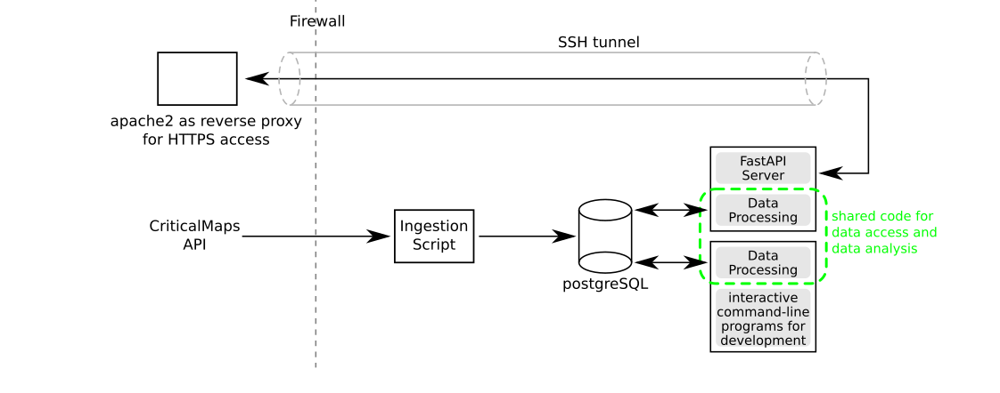

# README
Christoph Lechner, 3 June 2026

## Description


### Technologies used
- OS: Ubuntu Server 24.04 LTS
- PostgreSQL v18
- Python 3.10 or newer
  - notable packages used: FastAPI, scikit-learn, psycopg, pytest

## Motivation and Solution
The open-source project [CriticalMaps](https://www.criticalmaps.net/) ([repositories on github](https://github.com/criticalmaps/)) enables participants of ["Critical Mass"](https://en.wikipedia.org/wiki/Critical_Mass_(cycling)) events to share their current location with others on an interactive map.
Apps are available for the platforms iPhone and Android. In addition, you can see the current positions either in the app or [online](https://www.criticalmaps.net/map).

The CriticalMaps App (I only used the iOS version) is generally very well made.
There are however a few limitations that make catching up with a already moving CM pretty challenging:
- The geopositions of the other users sharing their location is only updating every 60 seconds. So if your phone is not mounted to the handlebar, you have to frequently stop and wait until the map is updated.
- Often 'randomly distributed' dots can be seen on the map. These are the result of:
  - app users who just want to watch the Critical Mass is going through their city while they themselves are not participating. Specifically for this the app offers an observation mode, but people might either not be aware of this function or simply forget to switch it on
  - app users who are currently catching up with the Critical Mass, or who had to leave early
  - app users who are sharing their current location with others for other reasons (they do not intent to join a Critical Mass event)

### Applied solution
In the following we make the reasonable assumption that bike events such as a Critical Mass correspond to several dots in close proximity on the map. These are the key steps of the data processing procedure:
- Identify "stationary devices", i.e. devices that haven't moved more than 100 meters in the last hour. These are likely app users who are just observing.
- Per default, these "stationary devices" are disregarded in the following.
- Then we run the [clustering algorithm](https://en.wikipedia.org/wiki/Cluster_analysis), currently [hierarchical clustering](https://en.wikipedia.org/wiki/Hierarchical_clustering) is used. The clustering algorithm has a configurable maximum distance to join a point to a cluster (or another point not yet part of a cluster). Only the current positions are taken into account for the clustering process.
  - There will be groups of points that are in close proximity.
  - On the other hand, some points are too far away from any other point. In this project, these are referred to as "single-point 'cluster'". For the following, they are not considered
- At the end of this analysis, we have several groups of points, the so-called "clusters".

Reasonable parameters may then be
* minimum cluster size N=3 (considering to set the minimum threshold higher)
* radius 300m (at 15km/h 500m would correspond to 120s, so one position update may even be lost)
* ignore "stationary" devices (devices that did not move more than 100 meters in the previous hour)
* ignore "isolated" devices (devices that aren't part of any clusters)

### Examples

## Running It
Once you have the database set up (adjust DB connection parameters in `db_conn.py` and test it using `check_db_conn.py`) and set up the DB using `schema.sql`, you can start to fill it using the API requestor `cmaps_data.py`.

For analysis of the stored data, there are currently two ways to run the software:
* for development, run the script `interactive_demo.py` on the command line
* to run the API server, run `api.py` (see elsewhere in this document for documentation of URI layout)

### Organization of URIs
Currently the URIs on the HTTPS Apache2 server are organized as follows:
* `/myapp/`: top path used by the app, contains static materials, served by Apache2
* `/myapp/api/`: forwarded to FastAPI by Apache2 acting as reverse proxy for HTTPS termination
* `/myapp/api/objs/`: images generated by FastAPI go here, served by FastAPI

### API Endpoints
Here we list the provided API endpoints and the implemented HTTP method.
- `/location` (POST): This is the main end point to be called by the PWA/interactive web site.
- `/location_demo` (GET/POST): End point for demo purposes only, uses hardcoded geolocation in Hamburg, Germany. Does return JSON data.
- `/inspect` (GET): Used by the PWA/interactive website to see a cluster in more detail
- `/clusters` (GET): Get JSON data describing the identified clusters in great detail. Implemented to facilitate the implementation of other interactive client programs.

## Data Downloader
The position data processed by this software project is periodically obtained from the CriticalMaps API.

### Health Monitoring
The downloader supports HTTP Health Monitoring.
Pass the desired port to listen on to the program at start-up:
```
./cmaps_data.py --status_port=22222
```

To check the health status of the data downloader, you can use `curl`.
The status code will be 200 if everything is ok, or 500 if no data could be downloaded for 900 seconds.
```
$ curl --head http://localhost:22222/check
```
In a production setting, this URL would be monitored with any URL monitor tool supporting GET or HEAD requests.
